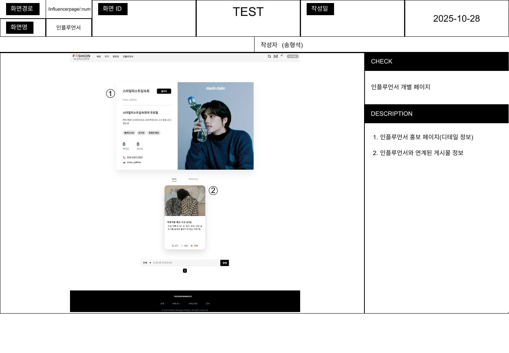

# 패션 매니저 - 패션 공유 커뮤니티

 

---

##  🖼️ FM 팀원 소개

|   |   |   |   |   |
| :--------------------------------------------------------------: | :--------------------------------------------------------------: | :--------------------------------------------------------------------------: | :-----------------------------------------------------------: | :--------------------------------------------------------------: |
|            |            |                        |         |            |
|      [박상윤](https://github.com/sangyoun1020)      |      [백준승](https://github.com/seoguhoe2)      |      [이순우](https://github.com/SoonWooLee1)      |      [송형석](https://github.com/thdgudtjr0415)      |      [김승민](https://github.com/indy0322)      |

 
 

-----

## 🗂️ **프로젝트 기획서: 패션 매니저 (Fashion Manager)**

 

### **1-1. 개요 (Overview)**

> ### **"오늘 이 스타일, 과연 괜찮을까?"**
>
>   - 내 패션 센스, 객관적으로 몇 점일까?
>
>   - 요즘 유행하는 스타일, 나에게도 어울릴까?
>
> -----
>
> SNS의 ‘좋아요’는 당신의 진짜 스타일을 말해주지 않습니다.
>
> **저희는 ‘당신의 스타일이 만들어지는 과정’에 집중합니다.**
>
> 이제, 당신의 진짜 패션 가치를 평가하고 발전시키세요.

 
`패션 매니저(Fashion Manager)`는 사용자가 직접 스타일을 업로드하고, 서로의 스타일을 평가하거나 피드백을 주고받으며

패션 감각을 향상시키는 **참여형 스타일 성장 커뮤니티**입니다.

단순히 데일리룩(OOTD)을 공유하는 것을 넘어, 다른 사용자들로부터 구체적인 평가와 조언을 얻고 

패션에 대한 다양한 주제로 소통하며, 검증된 패션 멘토에게 직접 멘토링을 받는 

**입체적인 패션 커뮤니케이션**을 제공하는 것이 핵심 차별점입니다.

저희는 패션을 과시와 소비의 대상을 넘어, 사용자가 **자신의 스타일을 객관적으로 진단하고 발전**시킬 수 있는 

**가치 있는 스타일 성장 생태계**를 제공하는 것을 지향합니다.

 

-----

### **1-2. 프로젝트 배경 (Background)**

#### **🤔 기존 패션 플랫폼의 문제점**

현재 대부분의 패션 콘텐츠는 인스타그램과 같은 SNS를 중심으로 공유되고 있습니다. 

이러한 플랫폼은 시각적 만족감과 ‘좋아요’를 통한 즉각적인 반응을 제공하지만, 사용자의 스타일 발전에 실질적인 도움을 주기에는 명확한 한계가 존재합니다.

  - **피상적인 피드백:** ‘예뻐요’, ‘멋져요’와 같은 칭찬에 머물러, 건설적인 비평을 찾기 어렵습니다.

  - **광고 중심의 콘텐츠:** 인플루언서와 상업적 콘텐츠가 주를 이뤄, 일반 사용자가 진솔한 피드백을 얻을 기회가 제한됩니다.

  - **성장의 기회 부재:** 객관적인 평가가 부재하여 자신의 스타일에 대한 확신을 얻기 어렵고, 개인의 고유한 스타일을 발견하고 발전시킬 기회를 저해합니다.

 

#### **💡 새로운 패션 품평 커뮤니티의 필요성**

본 프로젝트는 이러한 문제의식에서 출발하여, **개인의 스타일에 대한 구체적이고 상호적인 평가 시스템**을 제안합니다. 

TPO(시간, 장소, 상황) 적합성, 컬러 매치, 아이템 활용도 등 다각적인 기준으로 피드백을 주고받으며, 막연한 ‘좋아요’가 아닌 **데이터 기반의 스타일 분석과 소통**이 가능해집니다.

 

> #### **✨ 기대 효과 및 핵심 목표 ✨**
>
> -----
>
>   - **✅ 나만의 스타일 발견:** 객관적인 피드백을 통해 고유한 스타일을 발견하고 확립합니다.
>
>   - **🤝 유용한 정보 교류:** 나와 비슷한 취향, 체형을 가진 사용자들과 실용적인 정보를 공유합니다.
>
>   - **📈 성장 과정 추적:** 커뮤니티 활동 데이터를 기반으로 나의 패션 센스 성장 과정을 추적합니다.
>
>   - **🧩 패션 시야 확장:** 다양한 주제의 토론에 참여하며 트렌드를 분석하고 패션에 대한 시야를 넓힙니다.
>
>   - **⭐ 전문가 멘토링:** 검증된 패션 멘토에게 1:1 스타일링 조언을 받는 기회를 제공합니다.

---

# **✨ Fashion Manager: 주요 기능과 데이터 ✨**

각 기능이 어떻게 실제 데이터와 연결되는지 함께 확인해 보세요.

### 📸 스타일 업로드 및 상호 평가
- **데일리룩(OOTD)** 사진을 올리고 나만의 스타일을 설명해요.
  > 💾 **연관 데이터:** `Fashion_Post`, `Photo`, `Post_Item`, `Fashion_Item`, `Fashion_Hashtag`
- 다른 사람의 스타일을 보고 **‘찬성/반대’**나 **별점**으로 평가해요.
  > 💾 **연관 데이터:** `Post_Reaction`
- 매일, 매주 커뮤니티 투표로 **‘베스트/워스트 드레서’**에 도전해 보세요!
  > 💾 **연관 데이터:** `good_count`, `cheer_count`

---

### 🗣️ 패션 찬반 토론
- **'양말에 샌들'** 같이 재미있는 주제로 패션 토론에 참여해요.
  > 💾 **연관 데이터:** `Review_Post`, `Review_Category`
- **연령, 성별**에 따른 그룹 토론으로 다양한 의견을 들어봐요.
  > 💾 **연관 데이터:** `Member.age`, `Member.gender`, `Comment`
- 토론에 활발하게 참여하면 **배지, 포인트** 등 특별한 보상이 기다려요.
  > 💾 **연관 데이터:** `Badge`, `Assigned_Badge`

---

### 🤝 멘토-멘티 시스템
- 커뮤니티에서 인정받은 **전문가 ‘멘토’**가 직접 도와줘요.
  > 💾 **연관 데이터:** `Assigned_Right`, `Influencer_Apply`
- 고민이 있다면 원하는 멘토에게 **1:1 스타일링 피드백**을 요청할 수 있어요.
  > 💾 **연관 데이터:** `Mentoring_Post`, `Mentee_Apply`, `Message`
- **체형, 라이프스타일**에 딱 맞는 나만의 코칭을 받아보세요.
  > 💾 **연관 데이터:** `Member.height`, `Member.weight`, `Member.age`

---

### 🌟 인플루언서 공간
- 승인된 **인플루언서**가 되어 나만의 전용 페이지를 운영해요.
  > 💾 **연관 데이터:** `Influencer_Page`, `Influencer_Apply`
- 자신만의 스타일과 **SNS 계정**을 공유하며 팔로워와 소통할 수 있어요.
  > 💾 **연관 데이터:** `Photo`, `Comment`, `Message`
- **브랜드 협찬**이나 **추천 아이템**을 자유롭게 소개하고 공유해요.
  > 💾 **연관 데이터:** `Fashion_Item`, `Post_Item`

---

### 🛡️ 커뮤니티 안전장치
- 불쾌한 게시글이나 댓글은 **신고 기능**으로 바로 알려주세요.
  > 💾 **연관 데이터:** `Report`, `Report_Category`
- 신고가 누적된 사용자는 활동이 제한되며, **블랙리스트**로 관리돼요.
  > 💾 **연관 데이터:** `Blacklist`, `Member.status`
- 무분별한 신고를 막기 위해 **일일 신고 횟수**를 제한해요.
  > 💾 **연관 데이터:** `Member.daily_report_count`

---

### 🏆 리워드 및 성장
- 꾸준한 활동과 기여를 통해 특별한 **활동 배지**를 획득할 수 있어요.
  > 💾 **연관 데이터:** `Badge`, `Assigned_Badge`
- **좋아요/힘내요** 기록이 쌓여 나만의 활동 점수가 돼요.
  > 💾 **연관 데이터:** `good_count`, `cheer_count`
- 높은 활동 점수와 좋은 평판을 얻어 **멘토/인플루언서**로 성장해 보세요!
  > 💾 **연관 데이터:** `Assigned_Right`

 

---

## 2. 와이어프레임

    
와이어프레임

 </img>

 

---

## 3. 스토리보드

    
회원 정보

  
  #### 마이페이지
 </img>

  
관리자

  
  #### 관리자 페이지
 </img>  

  
게시물

  
  #### 패션 게시판 페이지
 </img> 

  #### 패션 게시물 페이지
 </img> 

  #### 패션 게시물 등록 페이지
 </img> 

  #### 후기 게시판 페이지
 </img> 

  #### 후기 게시물 페이지
 </img> 

  #### 멘토링 게시판 페이지
 </img> 

  #### 멘토링 게시물 페이지
 </img>

  
인플루언서 페이지

  
  #### 인플루언서 게시판
 </img>

  #### 인플루언서 게시물
 </img>

  
공통 레이아웃

  
  #### 헤더
 </img>

 

 

---

## 4. 기능 명세서

## 4-1. WBS

 </img> 
---

## 4-2. 요구사항 명세서 

 </img>
 </img>  

---

 

## 5. 테스트 결과 보고서

## 👤 회원 관리 테스트

  

    
회원

     
    

      
회원 가입

      
    

    

      
로그인

      
    

    

      
아이디 찾기

      
    

    

      
비밀번호 찾기

      
    

    

      
마이페이지 수정

      
    

  

 

## 🧑‍💼 인플루언서 페이지 테스트

인플루언서 페이지 검색

  

팔로우, 언팔로우

  

개인 게시물 조회

  

개별 조회

  

페이지네이션

  

팔로우, 언팔로우

  

 

## 게시물 테스트

패션 아이템 추가

  

게시글 작성 성공

  

게시글 삭제

  

게시글 이미지 추가

  

게시글 좋아요/힘내요 추가

  

게시글 내용 추가

  

게시글 온도 수정

  

해시태그 추가

  

멘토링 게시물

  

후기 게시물 시연

  

## 🚩 신고 관리

신고 추가

  

신고 상태 변경

  

신고 삭제

  

## ✉️ 쪽지 관리

일반 쪽지 송신

  

일반 쪽지 조회

  

멘토링 쪽지 송신

  

멘토링 쪽지 조회

  

---

## 6. 기술 스택

<h3>BACKEND</h3>

 
   
   
  
  

  

  
  
  
  

   

### FRONTEND

### DB

### SERVER

### TOOL

  
   

 

---

## 7. 동료 평가

### 백준승
| Team Member | Peer Review |
|----------|----------|
| 박상윤    | 백준승 팀원은 프로젝트 전반에 걸쳐 매우 적극적으로 참여하며 뛰어난 열정을 보여주었습니다. 세부적인 일정과 목표를 체계적으로 계획하고, 실행 과정에서도 꼼꼼하게 관리하는 모습을 보였습니다.예상치 못한 문제 상황에서도 침착하게 대응하며 팀의 방향을 안정적으로 이끌었습니다. 프로젝트의 완성도를 높이기 위해 지속적으로 개선점을 제안하는 등 높은 책임감을 보였습니다. 이러한 자세 덕분에 팀 전체의 진행이 효율적이고 체계적으로 이루어질 수 있었습니다. |
| 김승민    | 백준승 팀원께서는 누구보다 진지하게 프론트엔드 프로젝트에서 아이디어를 내주셨고 개발 중 본인이 부족한 부분, 힘든 부분을 매꾸기 위해 다른 팀원들에게 적극적으로 피드백을 받았습니다. 덕분에 시간 안에 기대하 것 이상의 결과물을 만들 수 있었습니다. 그리고 담당한 페이지가 프로젝트에서 가장 중요한 페이지여서 부담이 될 수 있었는데도 불구하고 완성해주셨고 발표까지 훌륭히 해내주었습니다. |
| 송형석    | 준승님은 게시물 관리 기능을구현했을 뿐만 아니라, 발표에서도 뛰어난 역량을 보여주셨습니다. 발표 준비 과정에서 팀원들의 다양한 의견을 조율하고 핵심을 명확히 정리해 주셨습니다. 개발과 발표 두 영역 모두에서 중요한 역할을 담당하며 프로젝트 완성도를 높여주셨습니다. |
| 이순우    | 준승님은 게시물 파트에서 저와 함께 훌륭한 협업 능력을 보여주었을 뿐만 아니라,이미지 업로드 기능 구현을 성공적으로 완수하여 프로젝트의 완성도를 높였습니다. 또한, 팀을 대표한 최종 발표까지 성공적으로 수행하며 팀의 성과 달성에 주도적인 역할을 해주셨습니다. |

### 박상윤
| Team Member | Peer Review |
|----------|----------|
| 백준승    | 상윤님은 프로젝트 중 여러 문제를 마주했지만 본인이 맡은 내용을 훌륭히 구현해주셨습니다. 어려운 상황에서도 맡은 기능을 구현해주셔서 프로젝트에 도움을 주셨습니다.  |
| 김승민    | 프로젝트에서 본인의 단점을 보완하기 위해 바쁜 시간을 쪼개어 추가적인 공부를 하였고 본인의 맡은 역할을 책임감있게 수행해주셨습니다. 프로젝트의 마이페이지 부분을 개발하면서 UX부분을 언제나 고려하였습니다. 팀원들이 놓칠 수 있는 디테일한 부분을 잘 찝어내주셨습니다. |
| 송형석    | 상윤님은 회원 관리 파트를 중심으로 구조를 세워주셨습니다. 언제나 차분하고 책임감 있는 태도로 팀에 신뢰를 주셨고, 문제 해결 과정에서도 깊이 있는 접근이 돋보였습니다. |
| 이순우    | 상윤님은 개인 페이지 기능 개발을 담당하며, 맡은 기능을 팀원과 협력하며 잘 완성해주셨습니다. 개발 과정에서 어려움이 있어도 포기하지 않고, 끝까지 완수하기 위해 노력하는 끈기 있는 자세가 인상적이었습니다. |

### 김승민
| Team Member | Peer Review |
|----------|----------|
| 백준승    | 승민님은 FM 프로젝트에서 중요한 기능이었던 회원 관련 기능 구현에 큰 역할을 해주셨습니다. 또 어려움을 겪는 팀원에게도 많은 도움을 주셔서 프로젝트 전반에 있어 본인의 역량 뿐 아니라 협업 능력까지 뛰어난 모습을 보여주셨습니다. 프로젝트가 진행됨에 따라 이런 상황에서 오는 피로도가 분명 존재했을텐데, 팀 분위기를 해치지 않고자 항상 소통에도 신경써주셔서 여러모로 우수한 팀원이었습니다. |
| 박상윤    | 김승민 팀원은 뛰어난 개발 실력으로 프로젝트의 전반적인 완성도를 높이는 데 큰 역할을 했습니다. 문제 해결 능력이 탁월해 복잡한 기능 구현이나 오류 수정 시에도 빠르고 정확하게 대응했습니다. 코드의 구조와 효율성에 대한 이해가 깊어 팀 전체의 개발 품질 향상에 기여했습니다. 다른 팀원들과의 협업에서도 적극적이며, 기술적인 부분을 명확히 설명해주는 능력이 돋보였습니다. 그 결과, 프로젝트 진행이 안정적이고 효율적으로 이루어질 수 있었습니다.|
| 송형석    | 승민님은 서버 관리와 배포 환경 전반을 책임지며 안정적인 시스템 구축에 크게 기여하셨습니다. 복잡한 기술적 문제가 발생했을 때도 빠르게 원인을 분석하고 해결책을 제시해 주셔서 팀원들에게 든든한 존재였습니다. |
| 이순우    | 승민님은 쪽지, 신고 등 핵심 회원 기능과 서버 파트를 안정적으로 구축했습니다. 그뿐만 아니라, 다양한 프론트엔드 부분의 지원까지 도맡아 주시며, 프로젝트 전반의 완성도와 안정성을 높이는 데 결정적인 기여를 하셨습니다. 그야말로 팀의 기둥으로서 다방면에서 핵심적인 역할을 수행해 주셨습니다. |

### 송형석
| Team Member | Peer Review |
|----------|----------|
| 백준승    | 형석님은 인플루언서 페이지 전반에 걸친 기능 구현을 맡아주셨습니다. 특히 형석님은 프로젝트 막바지에 갑자기 생긴 버그로 인한 어려움이 존재했었는데 본인이 맡은 역할을 책임감 있게 완수해주셨습니다. 이 과정에서 팀원들과 의미 있는 소통을 계속 진행하며 문제를 키우지 않고 해결하는 형석님의 협업 능력이 주효했다고 생각합니다. |
| 박상윤    | 송형석 팀원은 팀의 맏형으로서 중심을 잡아주며 팀원들이 조화롭게 임무를 수행할 수 있도록 이끌었습니다. 항상 침착하고 책임감 있는 태도로 팀 분위기를 안정적으로 유지시켰습니다. 프로젝트 전반에서 핵심적인 역할을 맡아 끝까지 책임을 다하며 모범을 보였습니다. 어려운 상황에서도 포기하지 않고 꾸준히 해결책을 찾아가는 끈기를 보여주었습니다. 송형석 팀원의 든든한 존재감은 팀원들에게 신뢰와 의지를 심어주는 큰 힘이 되었습니다. 이러한 리더십 덕분에 팀 전체가 하나로 뭉쳐 높은 완성도의 결과를 만들어낼 수 있었습니다. |
| 김승민    | 프로젝트에서 어려울 수 있었던 부분이었던 인플루언서 페이지를 개발해주셔서 팀의 주요 기능이 잘 작동되는데 기여를 해주셨습니다. 프로젝트 중에 팀원들의 아이디어를 잘 조율해주셨고 팀원들을 잘 중재해주셨습니다. 같은 팀원으로써 봤을 때 없어서는 안될 팀원이었습니다.  |
| 이순우    | 형석님은 프로젝트의 핵심 기능인 인플루언서 페이지 개발을 담당하며, 페이지에 생동감을 불어넣고 사용자의 몰입감을 높여주셨습니다.또한, '이미지 업로드' 기능 구현에도 기여하며 팀의 기술적 완성도를 높이는 데 크게 이바지 하셨습니다. |

### 이순우
| Team Member | Peer Review |
|----------|----------|
| 백준승    | 순우님은 댓글 및 좋아요 기능을 구현해주셨고 저와 협업해 게시판 기능 역시 함께 구현해주셨습니다. 본인이 맡은 기능을 구현해주셨을 뿐더러 팀의 분위기를 긍정적으로 만들어주는 순우님이 있었기에, 항상 긍정적이고 상황이 어렵더라도 힘을 낼 수 있는 좋은 협업 환경에서 함께 할 수 있었습니다. 기능 개발 뿐 아니라 주변의 분위기를 긍정적으로 만드는게 순우님의 최고의 장점인 것 같습니다.  |
| 박상윤    | 이순우 팀원은 매사에 성실하고 열정적으로 임하며 맡은 일에 최선을 다했습니다. 프로젝트 진행 과정에서 중심을 잡아주며 전체적인 방향 설정에 큰 도움을 주었습니다. 세부적인 구현뿐만 아니라 구조적인 틀을 설계해 프로젝트의 기반을 탄탄하게 만들었습니다. 이러한 책임감 있는 태도와 추진력 덕분에 팀의 목표가 안정적으로 달성될 수 있었습니다. |
| 김승민    | 페이지마다 들어가는 댓글 기능을 작업하기 위해 다른 팀원들과 누구보다 활발히 소통하였고 페이지의 헤더와 푸터 개발 등을 도맡아 하셨습니다. 그리고 저는 잘 하지 못하는 문서작업, 깃허브 리드미 등을 꼼꼼히 작성해주셔서 감사하다고 생각되는 팀원이었습니다. |
| 송형석    | 순우님은 댓글 및 좋아요 관리 기능을 구현해 주셨습니다. 맡은 역할을 책임감 있게 수행하는 동시에, 필요할 때마다 팀원들을 도와주는 협력적인 태도가 인상적이었습니다. 꾸준한 성실함과 협업 능력으로 프로젝트의 완성도를 높여주셨습니다. |

